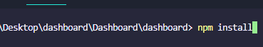
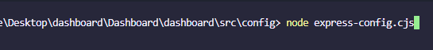
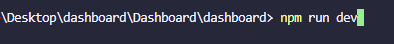
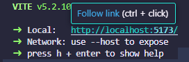
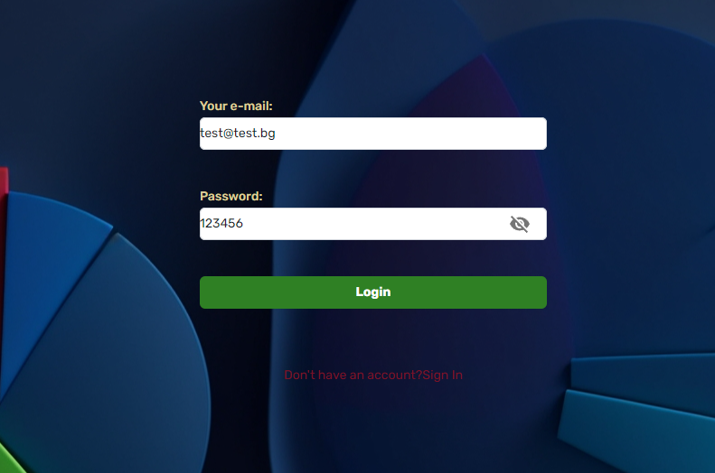

# Dashboard

This is a dashboard application built with React and TypeScript. It includes features such as user authentication, login, sign-in, a dashboard view and orders history view.

## Getting Started

These instructions will get you a copy of the project up and running on your local machine for development and testing purposes.

### Prerequisites

- Node.js
- npm

### Installing

1. Clone the repository: git clone https://github.com/DayanaVakareeva/Dashboard.git

2. Navigate into the project directory: cd dashboard

3. Install the dependencies: npm install 

#### Running the proxy server

1. Navigate into the config directory: cd dashboard/src/config

2. Run the server: node express-config.cjs

##### Running the Application

1. Navigate into the project directory: cd dashboard

2. Start the development server: npm run dev

3. Follow the link or Open your web browser and navigate to the URL output by the `npm run dev` command.

## Login

To log in, use the following credentials:

Email: test@test.bg
Password: 123456

### Built With

- [React](https://reactjs.org/) - The web framework used
- [TypeScript](https://www.typescriptlang.org/) - The language used
- [Express.js](https://expressjs.com/) - Used to create the proxy server
- [Tailwind CSS](https://tailwindcss.com/) - The utility-first CSS framework used
- [Material-UI](https://mui.com/) - The UI framework used
- [React Chart.js](https://reactchartjs.github.io/react-chartjs-2/) - Used for creating charts

### Author

- Dayana Vakareeva